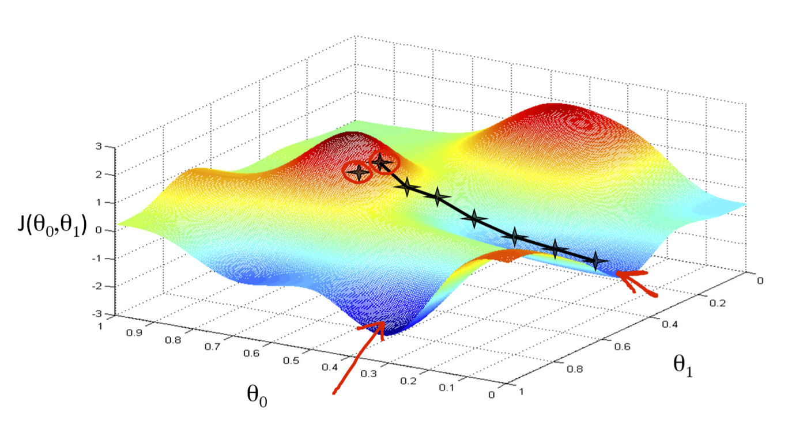

# General idea of ML
Proper definition can be hard to define but the main idea is to handle multivariate datasets that are too large to handle with normal statistical methods. Due to the scale of the data, we often rely on computational methods to carry out our statistical modelling, using certain parameters defined by the algorithms that optimise the fit for our given data, known as hyperparameters.

Machine learning problems can fall into several categories:
- Supervised learning
- Unsupervised learning
- Reinforcement learning

In this module, we will primarily focus on the first two categories.

## What is supervised learning?
In a nutshell, it is where we build a model on some given "training" data then evaluate the effectiveness using test data. It is common practice to split the dataset into training and test data.

##### More formally...
Data consisting of number of variables, with one or more output/response/target variables depending on other input/feature variables. We are interested in the relationship between the variables to address the following research question:
*Given another sample of input variables, can we forecast the response variable?*

Examples:
- Given previous earthquake readings, what is the likelihood of a next earthquake?
- Is there some correlation between a measurement and a presence of a disease?

Supervised learning can be further subdivided into different categories:
- If the response variable is numerical, then we have a regression problem
- If the response variable is categorical, then we have a classification problem

## What is unsupervised learning?
In a nutshell, we want to observe any patterns or common relationships within the dataset. Examples:
- If I supply some data on customer purchasing patterns, can I segment the data into groups so I can identify a segment I am interesting in targeting? 
- Can we think of the dataset in fewer dimensions without losing much information?
  
## Other areas not covered
- Reinforcement learning: Model learns by gaining "awards". For example, check out [this youtube video](https://www.youtube.com/watch?v=qv6UVOQ0F44) !
- Recommender systems: Learns from your patterns and provides recommendations accordingly
- NLP, Image classification, Deep Learning, etc!

## Different phases of ML modelling
Given a data set to analyse, there are two phases.
1. There is an exploratory phase, where the analyst tries to spot patterns and other
interesting features in the data;
2. If interesting features appear, and if there is reason to suppose the existence of some underlying statistical model for the data, then the analyst can form hypotheses, and carry out hypothesis tests by evaluating test statistics. This is the statistical phase.

In the univariate case, the exploratory phase is generally rather uninteresting, and one moves quickly into the statistical phase.

In the multivariate case, however, the exploratory phase is much more interesting.
And the statistical side less so, to some extent, as the underlying assumptions are less easy to confirm. A quotation:

*Much classical and formal theoretical work in Multivariate Analysis rests on assumptions of underlying multivariate normality — resulting in techniques of very limited value*

(from R.Gnanadesikan, Methods for Statistical Data Analysis of Multivariate Observations)

# Notation for ML

Observations are vectors $x = \left(x_1,...,x_p\right)$, so each observation consists of $p$ numbers. Therefore, we say that the data is *p-dimensional*

We denote the operation of transposing a matric with a dash ', so $x' = \begin{pmatrix} x_1 \\ \vdots \\ x_n \end{pmatrix}
$

For n observations and p parameters, we have a design matrix or data matrix X of dimensions n x p:

$$X = \begin{pmatrix}
    x_{11} & x_{22} & \dotsm & x_{1p} \\
    x_{11} & x_{22} & \dotsm & x_{1p} \\
    \vdots & \vdots & \ddots & \vdots \\
    x_{n1} & x_{n2} & \dotsm & x_{np} 
\end{pmatrix}$$

## Sample mean

$$\bar{x} = (\bar{x_1},\bar{x_2},\dotsm, \bar{x_p}) = \frac{1}{n}\Bbb{1}X$$

## Sample variance

$$S = \frac{1}{n-1}(X-\bar{X})'(X-\bar{X})$$

## Variance matrix features
The variance matrix is:
- symmetric
- real
- positive definite (as long as none of the variables is a linear combination of any of the
others)
    * The variables may be linearly related, e.g.:
        * one column could be summarising others (as an average, perhaps)
        - one column could be the difference of others
        - we might have n < p
- an unbiased estimator of the population variance (and xN is an unbiased estimator of the
population mean)

### Link with correlation matrix

$$S = L^{1/2}RL^{1/2}$$
Where S is the sample variance, L is the diagonal matrix of the sample variance and R is the sample correlation matrix.

Recall the following facts about real symmetric p x p matrices A:
- They have p linearly independent eigenvectors
- The eigenvalues are all real
- If $\lambda$ and $\mu$ are two distinct eigenvalues, then the corresponding eigenvectors are
orthogonal
If $\lambda$ is an eigenvalue of A with multiplicity k (i.e., if $(t-\lambda)^k$ divides the characteristic
equation), then we can pick k orthogonal eigenvectors of A with eigenvalue $\lambda$.
If also the matrix is positive definite, then:
- Every eigenvalue is positive

As a corollary:
If A is a real symmetric matrix, then there is $X \in M_{p x p}$ whose columns are normalised
eigenvectors of A (i.e., scaled to have length 1), which is an orthogonal matrix; i.e.

$$XX' = X'X = I_p$$

# Gradient descent

  We are often interested in choosing the optimal parameters for a given model to get accurate predictions, however, we need a way of measuring the accuracy. A common way is to use the mean square error, MSE:

$$MSE(\hat{y}) = \frac{1}{n} \sum_{i=i}^{n}(y_i-\hat{y_i})^2$$

where $y_i$ is the actual value of the response variable for the ith sample, and $\hat{y_i}$ is the value predicted by the model. An important point: The MSE is sensitive to outliers, so it should only be used if there are little to no outliers in your model

If you have many outliers, we can consider an alternative measurement known as the mean absolute error, (MAE):
$$MAE(\hat{y}) = \frac{1}{n} \sum_{i=i}^{n}|y_i-\hat{y_i}|$$

In either case, the key idea is we measure the differences between our predictions observed data in our test set. A function used to measure such differences are known as *loss functions* or *cost functions*.

For a general reference, [see this wikipedia article](https://en.wikipedia.org/wiki/Loss_function).

Regardless of our chosen of measurement for accuracy, we need to select model parameters that minimise the loss function. While this is straight forward for cases like simple linear regression, it becomes complicated when we have many parameters or use "less routine" statistics. To that end, we consider numerical methods like **gradient descent**.

At its core, gradient descent is an algorithm that calculates the parameters in a model that minimises the change in the loss function with respect to its parameters. In other words, the gradient! More formally, we can write the following formula:
$$\nabla MSE = \left(\frac{\delta MSE}{\delta \lambda_1}, \dotsm , \frac{\delta MSE}{\delta \lambda_r}\right)$$

where $\lambda_1, \dotsm, \lambda_r$ are the parameters in the model. If we adjust the parameters by a small amount in the opposite direction, such as $-(\epsilon \times \nabla MSE)$ for some small $\epsilon > 0$ to the parameters, we would expect the loss function to decrease. In some cases, the $\epsilon$ is known as a the **learning rate**.

We continuously adjust the $\epsilon$ until we find a local minimum. Since we have a lot fo data, this can be a slow process. To speed it up, we can look for other optimisation methods such as **[stochastic gradient descent](https://en.wikipedia.org/wiki/Stochastic_gradient_descent)**, which looks at a random sample of the dataset to compute the loss function. Of course, there is a trade off between accuracy and efficency, so you should consider your context carefully before proceeding.

Gradient descent isn't without issues. In any multivariate setting, it's common for functions to have many "minimum" points known as a local minima. The point where gradient descent converges does not guarantee it is the lowest minimum possible (known as the global minimum). 

To avoid this, we can randomly select different starting points and run the algorithm, hoping to find the global minimum. This is a problem in particular for neural networks as they have many parameters to deal with!