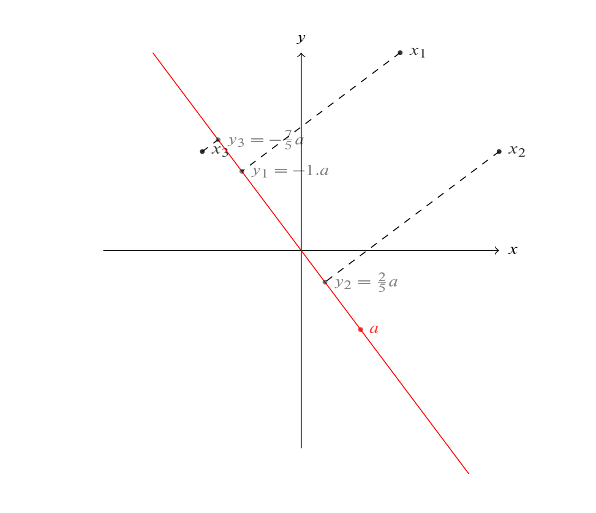

# PCA

Machine learning often involves dealing with not only big datasets but high dimensional datasets! In other words, lots of features to consider relationships between! Conventional data vis methods often fail to display the data in a meaningful way at high dimensions, so what can we do about it?

Well, since we have a very large dataset, we can probably afford to lose a tiny bit of data without too much loss in our model accuracy. At a high level, to achieve this, we can do the following:

- Based from our research question, consider which features are most important to us
- From the "least important" features, try to group them together to reduce the dimensions
- Continue to reduce until we hit a "plotable" dimension (2 is most desirable!)

In maths language, we would say:

> Given n points in p-dimensional space $\mathbb{R}^p$, and some number q < p, find the "best" q-dimensional space $\chi \subseteq \mathbb{R}^q$, and projections[^1] of the n points into $\chi$ so that as little information is lost as possible

In "English": "Find a way to take your p features and reduce them as low as possible with minimal data loss". 

## The aim, mathematically speaking

In this course, we will only focus on linear transformations. We need to find a linear combination that can represent our "reduced" dataset after we have transformed the data. What we consider "most interesting" are points that have a maximum variance. This is because different features will have different values, so we can assume that values that are significantly different from each other are from different categories[^2].

We know that we like to summarise data using matrices, so let's get out our notation! Let $X$ be our design matrix with n x p dimensions and $Y$ be our "reduced" matrix. In linear algebra, we can transform a matrix X by applying  a matrix product with another, which we will call A. So now we have:

$$
Y = XA
$$

...where A is a p x p matrix. We keep it symmetrical here for statistical reasons[^3]. Since A is orthogonal then the transformation $X \rightarrow Y$ is also an orthogonal transformation (Just a rotation/reflection onto the p-dimensional space). Let's consider an example. Say I have three data points, $x_1 = \begin{pmatrix} 1 \\ 2 \end{pmatrix}, x_2 = \begin{pmatrix} 2 \\ 1 \end{pmatrix},x_3 = \begin{pmatrix} -1 \\ 1 \end{pmatrix}$ and $a = \begin{pmatrix} \frac{3}{5} \\ -\frac{4}{5} \end{pmatrix}$.

This means our design matrix is:
$$
X = \begin{pmatrix} 1 & 2 \\ 2 & 1 \\ -1 & 1 \end{pmatrix}
$$

and when we apply the transformation:

$$
Y = XA = \begin{pmatrix} -1 \\ \frac{2}{5} \\ -\frac{7}{5} \end{pmatrix}
$$

Graphically:


This means we can think about PCA as simply a linear combination of a x values with the a values:
$$
y = xa = a_1x_1 + \dotsm + a_px_p
$$

In the context of PCA, we want to find some orthogonal coordinates such that the first combination has the largest variance, then the second combination has the second largest, and so on. From this, we can start build up a framework to deriving for what values of a we can achieve the above linear combination. First, let's consider how to get the first value of a.

### The variance of XA

We know from the rule of random variables that Var(aX) is the same as $a^2Var(X)$, so the same can apply here:
$$
Var(Xa_1) = a_1'Var(X) a_1 = a_1'Sa_1
$$

This is where having A being symmetric comes in handy! S here represents the Variance of the matrix X or the *variance-covariance matrix*. We hope to maximise $a_1'Sa_1$ while ensuring $a_1'a_1 = 1$ so we can normalise our data[^4], but how can we do this?

Well, if you've studied mathematics long enough, then you should think of differentiation! 

## An aside - Performing PCA in python with scikit-learn

Fortunately, many computational packages have been developed to make PCA straight forward to implement for large datasets. Here's an example from DataCamp:

```python
# Import the PCA object
from sklearn.decomposition import PCA
# Instantiate the PCA object
model = PCA()
# Fit our data
model.fit(samples)
# Transform the data 
transformed = model.transform(samples)
```

sklearn is the module that is imported from the scikit-learn library, which provides a useful "toolkit" for a lot of ML modelling. Due to its shear size, we should only import what we need, which in this case is the PCA object. The syntax here `from sklearn.decomposition import PCA` can be read as "FROM the decomposition portion of the sklearn module, get the PCA object"

In python, we usually rely on objects (or classes to be more precise!) to perform all our modelling needs. This is unlike R, where we rely more on functions to serve our needs. In this scenario, PCA will be used to fit our data and apply a PCA transform.

For the next line, we instantiate the PCA object. This is common practice because we don't need to use directly, we can just make a reference to it. This is because we intend to use it many times, so it's good practice to make a copy like this.

We then fit our data by applying the `.fit()` method to the `model` object. Behind the scenes, the PCA object will determine the best linear combination that not only reduces the dimensions of our data, but also ensures each combination has a decreasing order of variance (with the first entry being the largest). More precisely, the PCA object calculates the eigenvectors and eigenvalues during this process.[^5]

Following that, we can transform our values siuing this linear combination derived from the `.fit()` method by using the `.transform()` method. You can also apply the transformation to new data.

Inside the transformed data, it will be a `2D numpy array`, which is similar to a n x 2 matrix.

[^1]: Tip! Often when we talk about transforming data, mathematicians will terminology such as "maps" or "projections"
[^2]: Of course, this assumes the data is perfectly normally distributed
[^3]: The variance-covariance matrix is a real, positive definite matrix and therefore is symmetrical. This is a key feature as it is used to calculate the variance. To ensure we transform things appropriately, we should be consistent and ensure we make A symmetrical too
[^4]: You might have expected it to be $A^2$ but it's actually A and its transpose! This is because A is symmetric, so $A = A'$. The beauty part of it being symmetric means we can cleanly find the product of S and A, then take the product of that result with A'. This allows us to get the desired dimensions!
[^5]: Why do we use objects in python over functions? This is because while python is a "multi-paradigm" language (i.e can accommodate many different coding styles), a lot of libraries will utilise an object-orientated approach. This style allows flexibility and gives the code a clear structure, along with many other benefits. To accommodate this, methods (member functions) are often preferred to normal functions as seen in R.