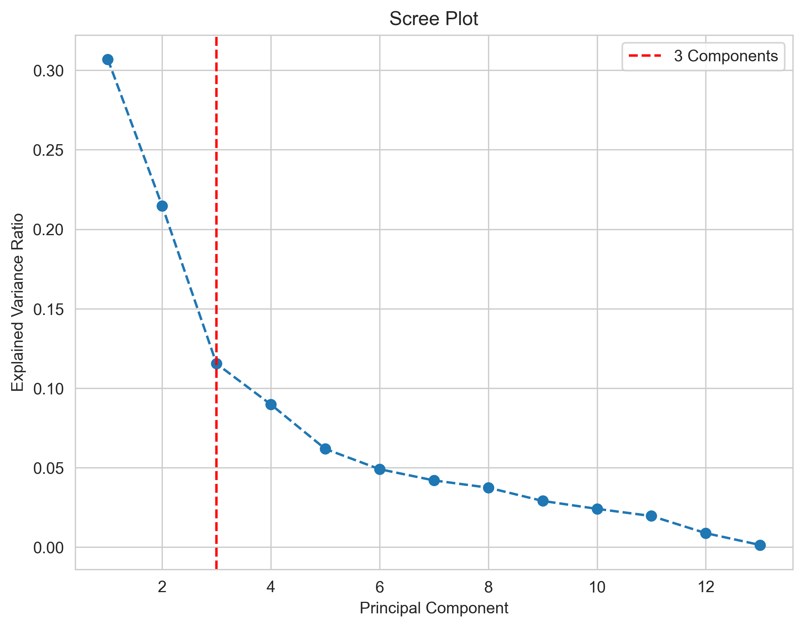
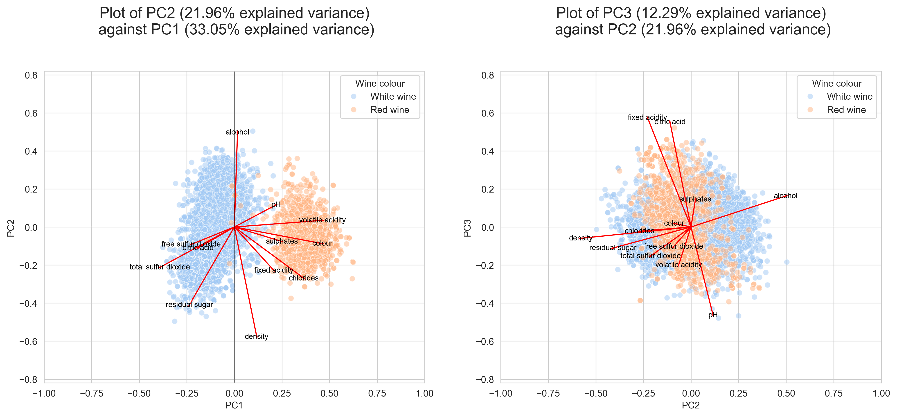

---
output:
  pdf_document:
    keep_tex: yes
    citation_package: biblatex
    latex_engine: xelatex
bibliography: ReferencesProject1.bib
csl: harvard.csl
urlcolor: blue
---

# Introduction

Portugal has been long celebrated for its wine production, from port wine to _vino verde_ from the Minho province. To address growing demand, the wine industry is interested in optimising its wine production. As wine is a food product, most of its prized features are taste and aroma, which are subjective measurements.
Previous studies have tried to categorise wine by quality through combining human taste testers, physicochemical analysis and statistical methods in attempts to introduce objectivity^1^. In this project, we are most concerned with which **particular variables** are essential for considering wine quality. By knowing which variables should be prioritised, this can motivate further study on optimising the wine according to essential attributes and enforce more efficient production.

Therefore, this report aims to address the following questions:

1. What are the main chemical differences between red and white wines?
2. Which variables are associated with wines of higher quality overall, and for red and white wine individually?
3. Are there any differences between mean acidity values of wine?
4. Are there any differences between mean sulfate/sulfur dioxide values of wine?

The dataset utilized in this study is drawn from laboratory tests, offering a detailed examination of the chemical composition of wines from Portugal's Minho region. It includes an extensive array of variables such as fixed acidity, volatile acidity, citric acid, residual sugar, chlorides, free sulfur dioxide, total sulfur dioxide, density, pH levels, sulphates, alcohol content, and a subjective quality rating on a scale of 0 to 10, where 10 signifies the highest quality. Additionally, a color indicator, acting as a dummy variable, distinguishes between red and white wines.

The data underwent outlier checking, with a total size of 6497 entries. To balance outlier removal without sacrificing too much data, a 5% threshold (325 entries) was set as the maximum limit for removal. An Interquartile Range (IQR) check was applied, a common procedure involving data less than Q1 - 1.5IQR or more than Q3 + 1.5IQR. However, due to a significant loss of data, a stricter threshold of 2.5 was chosen instead.

## PCA - Chemical differences between red and white wines

{width=50%}

Looking at the scree plot, the elbow appears around n = 3 components, so we will use this when proceeding with our PCA model. When considering the key chemical differences between red and white wines, we need to identify which features produce large loadings for our model. These features will help maximise the lagrange multiplier, producing the largest variance which is essential in differentiating the chemical differences between red and white wines.

### PC1 component analysis

From the left biplot, we observe positive loadings for pH, volatile acidity, sulfites (free sulfur dioxide, total sulfur dioxide), colour, fixed acidity, density and chlorides. Notably, colour is coded as a binary dummy variable, where 0 is white wine and 1 is red wine. Therefore, **red wines will score higher on PC1 than white wines**. We can use this to extrapolate any relationships between the colour variable and other chemical metrics. All other factors being equal, white wines with high volatile acidity and chlorides can score nearly as high as red wines with low volatile acidity and chlorides. This suggests that there is a positive correlation between a wine colour, volatile acidity and chloride concentration, implying that **red wines tend to have higher volatile acidity and chlorides than white wines**. The increased fixed acidity concentration could be due to how red wines use the seed and skin in addition to the pulp, which tend to contain more tartaric acid whereas white wines only tend to use the pulp, thus increasing the fixed acidity of red wines.^2^

Paradoxically, wines with a higher pH (implies less acidic solution) and acidic traits tend to score higher in PC1, but this can be explained as these wines tend to have higher sulphates, which are basic and increase the pH of the alcohol. This suggests that **red wines tend to have a higher pH than white wines from the sulphate content**.^3^

Alcohol and density seem to have little difference between red and white wines, indicating that alcohol and density are not key chemical differentiators between and white wines.

For the left quadrants of the left plot, we can see negative loadings for residual sugar, sulfites and citric acid. We have previously deduced that positive loadings imply properties more associated with red wine, hence higher values for the aforementioned properties are related to white wines. In particular the data suggests that **white wines tend to have higher levels of sulfites than red wines**. This is expected as white wines are more susceptible to oxidation than red wines, so more sulfur dioxide is used to act as an anti-microbal agent^3,4^.

**Conclusion: The data suggests that the main chemical differences are red wines tend to contain more acids but have a higher pH  than white wines to balance out its acidity. In contrast, white wines tend to contain sulfur dioxide than red wines to help prevent microbial growth.**

## PC2 and PC3 analysis

For completeness, we will check the right plot to check our conclusions drawn from the previous section. For PC2 and PC3, for all things being equal, the wine colour does not affect the PC2/PC3 scores, suggesting that different wine characteristics as a whole will influence the score. To score highly for PC2, wines need to have high alcohol concentrations with low density, sulfites, chlorides and residual sugar. As sugar is used by yeast to produce alcohol, this could account for wines that use sweeter grape varieties, wines that score the highest include low residual sugar but higher amounts fo alcohol. To score higher on PC3, wines need to have low pH with high fixed acidity and citric acid. This category could be a measure of extra components added to the wine to enhance flavour and aroma, as citric acid is commonly added to introduce freshness.^5^

## PCA - Attributes present in wines of high quality
As the quality variable contains many categories, it makes it difficult to visualise. Thus, the data was grouped into three categories, such that $x_{low_quality} \in [3, 4, 5]$, $x_{medium_quality} \in [6]$ and  $x_{high_quality} \in [7, 8, 9]$, then further divided by wine colour. The PCA model in question does not use this dummy feature in its fit, only the colour and quality instead.

### Analysis - alcohol

When considering the left plot, we can see for higher quality wines overall have negative PC2 scores but high quality red wine has a positive PC1 score and high quality white wine has a negative PC1 score.  As the alcohol loading is close to zero for PC1 but large and negative for PC2, this suggests that higher alcohol concentrations are more likely to be present for wines of higher quality. Furthermore, as most of datapoints for wine types are divided by PC1=0 line (whites on left, reds on right), we can say this property **is not unique to red or white wine, rather it applies to both of them**. This is further supported by looking at the right plot, where most of the high quality wines lie in the top left quadrant of the plot and the quality/alcohol arrows point in the same direction.

### Analysis - volatile acidity

Observing both plots we can see that greater volatile acidity is more associated with lower quality wines as the arrow is in the same quadrant as 3-5 red and 5 red points. In particular, it appears to be specific to red wines as the volatile acidity is more associated with red wine as seen in our previous analysis, therefore, **lower volatile acidity is likely to be present in higher quality red wines**.

### Analysis - fixed acidity

Total sulfur dioxide has small positive PC1, PC2 scores but a large and positive PC3 score. As more quality wines tend to lie on the bottom quadrants (negative PC2 scores), we can deduce that higher quality wines will tend to have lower fixed acidity than lower quality wines. This is further supported by the right plot, where the fixed acidity loading is in the right quadrants, which tends to be where most of the lower quality wines are. Fixed acidity while more associated with red wine from the plots, some lower quality white wine loadings are present in the same quadrant (though not as much) suggesting **lower fixed acidity is likely to be present in higher quality red wines and white wines (to a lesser degree)**.

## Conclusion

In summary, higher quality wines tend to have higher alcohol levels and lower volatile/fixed acidities. When factoring in by wine type and their chemical differences, it seems volatile acidity plays a key role in determining not only wine type but its quality for red wines as well. Therefore, further research should be concentrated on optimising fixed acidity levels to produce high quality wines.

# Hotelling T square test

So far, we have explored what particular features are present for wines of good quality, as well as main chemical differences between red and white wines. We highlighted that volatile and fixed acidity are different for red and white wines, but we should verify this through a statistical test. As our data is multivariate, we cannot perform a standard two sample student t-test, but we can instead perform a *A hotelling $T^2$ test*. For a 2 group case (red and white wine), we can perform a MANOVA fit and obtain the Hotelling $T^2$ statistic and the F-value. Confidence intervals were calculated using a function I wrote myself based on statistical theory. The hotelling T statistic is 1.66 and the F-value is 3292.11. See code for details.

**H0**: The mean volatile acidity, fixed acidity and pH are equal for both red and white wines

There is very strong evidence (p<0.001) to reject the null hypothesis that the mean volatile acidity, fixed acidity and pH are equal for both red and white wines. It seems at least one of the acidity means for red wine is different to white wine with averages of volatile acidity 0.23 95% simultaneous CI (-28.35, 27.85) g(acetic acid)/dm$^3$, fixed acidity  1.10  95% simultaneous CI (-256.65, 253.73) g(tartaric acid)/dm$^3$, pH 0.14 95% simultaneous CI (-34.34, 34.09). As a follow-up analysis, we can produce boxplots to see which particular acid metric is the most different.

From the boxplots, it seems most of the red wine volatile acidity tends to have higher mean values than white wine, which could explain why the test result was statistically significant.

## Hotelling T test - 1 sample

Sulphates and sulfur dioxide have not been explored much in this report compared to acidity, but they still play an important role to wine quality as they affect wine aroma. The sample means of white wine for free sulfur dioxide, total sulfur dioxide and sulphates were calculated to be 34.92 mg/dm$^3$, 137.80 mg/dm$^3$ and 0.49 g(potassium sulphate)/dm$^3$ respectively. Statsmodels comes with a 1 sample hotelling t test if you use test_mvmean `
from statsmodels.stats.multivariate import test_mvmean` [as shown here in their docs](https://www.statsmodels.org/dev/generated/statsmodels.stats.multivariate.test_mvmean.html). The F statistic is 3682.53 (2dp) and the hotelling value is 11064.99 (2dp)

**H0**: The mean free sulfur dioxide, total sulfur dioxide and sulphates for white mean are equal to the sample means for red wine

There is very strong evidence (p<0.001) to reject the null hypothesis that the mean free sulfur dioxide, total sulfur dioxide and sulphates are equal for both red and white wines. It seems at least one of the sulfate means for red wine is different to white wine with averages of free sulfur dioxide -18.61 95% simultaneous CI (-1011.28, 1043.90) g/dm$^3$, total sulfur dioxide  -90.95  95% simultaneous CI (-3210.83, 3304.53) g/dm$^3$, sulphates 0.14 95% simultaneous CI (-11.16,  12.43) g(potassium sulphate)/dm$^3$. As a follow up analysis, we can produce boxplots to see which particular sulphate metric is the most different (Omitted due to space, but code available to generate them). From the boxplots, it seems most of the red wine total sulfur dioxide tends to have higher mean values than white wine, which could explain why the test result was statistically significant.

### References
1. CORTEZ, P., CERDEIRA, A. L., ALMEIDA, F., MATOS, T. & REIS, J. 2009. Modeling wine preferences by data mining from physicochemical properties. Decis. Support Syst., 47, 547-553.
2. SOKAČ CVETNIĆ, T., GUNJEVIĆ, V., PUŠEK, A., JURINJAK TUSEK, A., DUJMIĆ, F., BRNCIC, M., KOVAČEVIĆ GANIĆ, K., JAKOVLJEVIĆ, T., UHER, D., MITRIĆ, G. & RADOJCIC REDOVNIKOVIC, I. 2022. Comparison of Drying Methods and Their Effect on the Stability of Graševina Grape Pomace Biologically Active Compounds. Foods, 11, 112.
3. PEZLEY, M. E. 2023. Production of free sulfur dioxide by wine yeasts.
4. NIOI, C., LISANTI, M. T., MEUNIER, F., MASSOT, A. & MOINE, V. 2023. Yeast derivatives: a promising alternative for white wine oxidation prevention. IVES Technical Reviews, vine and wine.
5. VICENTE, J., BARAN, Y., NAVASCUÉS, E., SANTOS, A., CALDERÓN, F., MARQUINA, D., RAUHUT, D. & BENITO, S. 2022. Biological management of acidity in wine industry: A review. International Journal of Food Microbiology, 375, 109726.