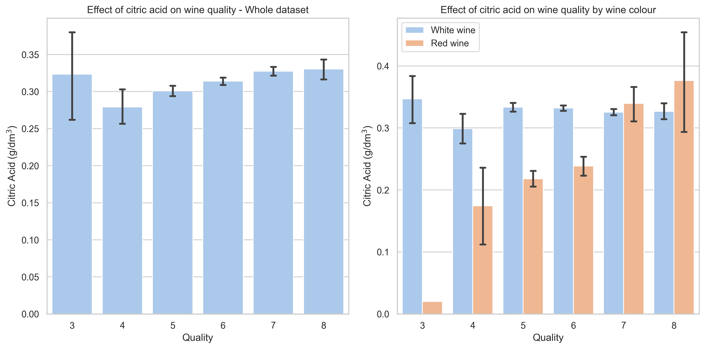

# Introduction

Portugal has been long celebrated for its wine production, from port wine to _vinho verde_ from the Minho provience. To address growing demand, the wine industry is interested in optimising its wine production. As wine is a food product, most of its prized features are taste and aroma, which are subjective measurements. 
Previous studies have tried to categorise wine by quality through combining human taste testers, pysciochemical analysis and statistical methods in attempts to introduce objectivity. In this project, we are most concerned with which **particular variables** are essential for considering wine quality. By knowing which variables should be preiotisted, this can motivate further study on optimising the wine according to essential attributes and enforce more efficient production.

Therefore, this report aims to address the following questions:

1. Which variables play a significant role in ascertaining the quality of red and white wine?
2. Are there any trends between wine attributes and its percieved quality?
3. Are there any differences between mean acidity values of wine and its quality?

The dataset employed in this study comprises data sourced from laboratory tests, providing an intricate look into the chemical composition of wines from Portugal's Minho region. 
It encompasses a comprehensive range of variables, including fixed acidity, volatile acidity, citric acid, residual sugar, chlorides, free sulfur dioxide, total sulfur dioxide, density, pH levels, sulphates, alcohol content, 
and a subjective quality rating on a scale of 0 to 10, where 10 represents the highest quality. Additionally, a color indicator, as a dummy variable, distinguishes between red and white wines. 


- Wine is culturally significant to the region so finding ways to improve taste and aroma is key
- As taste and aroma are subjective methods, finding relationships what can improve taste/aroma can help introduce more objective measurements
- Therefore, I aim to investigate which variables play a significant role in ascertaining the quality of red and white wine. What relationships are there? Difference between red and white wine?

## Which variables are essential for wine quality?


- Wine is culturally significant to the region so finding ways to improve taste and aroma is key
- As taste and aroma are subjective methods, finding relationships what can improve taste/aroma can help introduce more objective measurements
- Therefore, I aim to investigate which variables play a significant role in ascertaining the quality of red and white wine. What relationships are there? Difference between red and white wine?

## Raw analysis

Plotted Scree plot. Found that up to `PCA(n_components=4)` yields 92% explained variance. Additional PCA doesn't benefit too much.

```python
from sklearn.preprocessing import StandardScaler
from sklearn.pipeline import make_pipeline
from sklearn.decomposition import PCA
import matplotlib.pyplot as plt
pca = PCA(n_components=4)
scaler = StandardScaler()
pipeline = make_pipeline(scaler,pca)
fit = pipeline.fit(wine_data_all)
explained_variance = pca.explained_variance_ratio_

# Create the scree plot
plt.figure(figsize=(8, 6))
plt.plot(range(1, len(explained_variance) + 1), explained_variance, marker='o', linestyle='--')
plt.title('Scree Plot')
plt.xlabel('Principal Component')
plt.ylabel('Explained Variance Ratio')
plt.grid(True)
plt.show()
```

## Analysis from table

```python
loadings = pca.components_.T

# Create a DataFrame with labeled columns
num_components = loadings.shape[1]  # Number of PCA components

# Create a DataFrame with columns labeled as "PCA 1," "PCA 2," ...
pca_columns = [f'PCA {i + 1}' for i in range(num_components)]
pca_df = pd.DataFrame(loadings, columns=pca_columns)

# Add the corresponding feature names as row labels if needed
pca_df.index = wine_data_all.columns

# Display the PCA component loadings
pca_df
```
PCA1: Total/Free sulfur dioxide have negative eigenvalues; around -0.35. These values are correlated and likely share info between tehm. Therefore, wines with high amounts of SO2 will have lower PCA. Colour is a major factor in PCA1 with eigenvalue around 0.45. This means That red wines will have larger contribtuions to PCA1 than white (Red is coded as 1). Some contribution to volatile acidity (0.36) and a bit from chlorides (0.3), so wines with some acidity and chlorides will contribute modestly to PCA1 scores. Some sweeter wines (residual sugar) will have slihgtly lower PCA1 score, -0.23. This could be attributed to white wines as they are often more concerned with some sweetness than red wines. All other attributes do not contribute much to score.

Conclusion from PCA1: Wines of different colours can be differentiated by their sulfur dioxide content, acidity and chlorides. Little contribution of sweetness

PCA2: Colour differences not of concern here,colour is 0.04, so no difference to score. Alcohol content is significant, as more alcohol content reduces the PCA score (-0.5). Density significant as well (0.53), so more dense wines will increase the score.  More sugar will raise score (0.39) and it's interesting here because more sugar means higher alcohol content in the wine. Higher quality wines have slightly lower PCA2 scores (-0.28) and minor contributions to positive socres from sulfur dioxide.

Conclusion from PCA2: It seems that density and alcohol content are key differenitators, with some from quality and sugar.  Across both wines, Density contribution to mouthfeel and as quality is negative, we want higher alcohol content and less dense wines to have good quality wines.

PCA3: Citric acid and fixed acidity are significant contributors, where more acidity increases the score (0.59, 0.47 respectively). Higher pH values will decrease the PCA score (-0.41). This makes sense as a lower pH means a more acidic wine. Some contribution from quality of wine (better quality means higher score, 0.29), alcohol content (0.21, more alcohol => higher score) and more volatile acidity means a lower score (-0.28). Colour makes no difference to score.

Conclusion from PCA3: Acidity seems the most signicant factor for this score, with some from quality and alcohol content.

PCA4: Higher sulphates, quality and pH all raise the score of PCA4 (0.54, 0.5, 0.46 respectively). Higher free SO2 also increases score (0.34). The pH makes sense as higher pH means a more alkaline wine, which is supported by the strong, positive sulphates score.

Conclusion from PCA4: Quality and pH levels are key factors for PCA4 score.

Overall conclusion: Aggregating all this information together, we can observe that fundementally, acidity and wine colour are most important factors to consider when differentiating wines.


## Next steps

- Pairplots
- Addressing research question
- Cross validation? Maybe evaluate performance with conclusion
- Consider EDA to illustrate correlation (Can be done through summary statistics) and other interesting relationships

## EDA - How does citric acid play a role in quality of wines?
- Citric acid plays a vital role in wine production
- It helps add freshness to the wine, allowing more lively and enjoyable tasting experience, but too much makes it harsh, difficult to drink^[@RN3]
- Therefore, we are interested in any trends between citric acid concentration and perceived wine quality
- Question: Specific to wines of the minho region, what ranges of concentrations is related to wine quality?

- Across dataset:
  - High citric acid for low quality (but not certain due to low numbers in category 3 and large error bar)
  - Steady increase from quality 4 to 8, but plateaus around 0.33 g/dm$^3$
  - Wines that are "high quality" tend to have citric acid concentrations between 0.30 g/dm$^3$ and 0.35 g/dm$^3$
- Between wine groups:
  - In general, citric acid concentration over higher quality white wine seems to be fairly consistent, around 0.30 g/dm$^3$ and 0.35 g/dm$^3$
  - Red wine much more drastic. Even after accounting for large error bars from smaller datapoints for red wine, there is a clear increase between higher quality wines have more citric acid
- Conclusion: It seems that higher quality red wines have more citric acid in them, but it is unclear whether red wine quality of 9 or higher will have more citric acid due to the large error bars. What is apparent is higher quality wines in general tend to have citric acid concentrations between 0.30 to 0.35 g/dm$^3$. This disparity could be explained by how white wines tend to have more residual sugar than red wines, where adding some freshness is more necessary to balance out the additional sweetness.^[@RN1]


