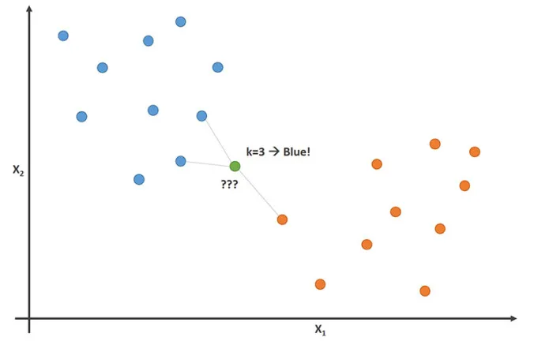
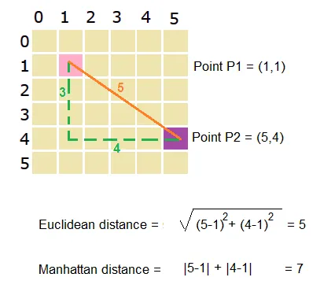

# Introduction
scikit is a dedicated python library for developing and evaluated machine learning models.  The basic syntax has the following flow:
```{python}
from sklearn.module import Model # Import relevant models and classes
model = Model() # Instantiate the model
model.fit(X,y) # Fit the data
predictions = model.predict(X_new) # Make predictions
```

# KNN classification
K-Nearest Neighbors is a classification algorithm (can be used for regression also) that works on the basic principle that the points belonging to the same class should be closer to each other.

Suppose we have a dataset having two features X1 and X2 and we plot the data points using a scatter plot. In the above image, we can see that the orange dots belong to class 1 and the blue dots belong to class 2.

Now a new datapoints i.e. green dot comes in and we need to classify whether it belongs to the orange class or the blue class.

Now we perform the following steps.

1. Select a value of K(here 3) i.e the number of closest points to green dots that we are going to consider.
2. Calculate the distance of the green dot with these points to find the K(3 here) closest points.
3. After finding the K(3 here) closest points, we check to which class these points belong.
4. Now our green dot will belong to that category that has the maximum number of points in selected closest points.

## Intuition

The intuition behind K-Nearest Neighbor is that the points belonging to the same category should be closer to each other in comparison to points belonging to different categories.

## How do I choose K?

Choosing the value of k is a highly iterative process.
You can try multiple values of k and for each value of K, calculate the error rate on the predictions.
Now plot this K v/s error rate and select the value of k for which the error rate is minimum.
How do we calculate the distance between points?

Now we know how the K-Nearest Neighbors works. Let’s see how we can calculate the distance between the points. There are preferably two methods to measure distance in K-NN.



- The above clearly shows both Euclidean distance and Manhattan distance
- Manhattan distance is preferred over euclidean distance when the dimensionality of data is too high.

## Impact of data on KNN

If we have highly imbalanced data, then our KNN model will be biased towards the class having a higher number of data points. This is so because when we’ll be calculating the nearest neighbors, there will be a high probability that most of the points will belong to the class having more data points(this probability will increase as we increase the value of K).
KNN is highly sensitive to the presence of outliers in the dataset. Outliers adversely affect the performance of our KNN model.

## Practical Application of KNN

- Recommender System: KNN is heavily used in recommendation systems like the one you see on websites like Amazon, Netflix, etc. KNN is used to recommend the group which is closest to the category you searched for.
- Concept Search: Concept search is a search based on the concept of searching similar items from an unstructured database based on the query you provided.

# Using KNN models in scikit-learn
In scikit-learn, to build a KNN model, we call the KNN classifer object and instantiate it, defining the number of neighbours. The term classifier is used here as the number of neighbours we use is what helps classify our data into different categories.

To assist with model building, we split the data into training and test sets. In the code below, we take 80% of the data as training data and the remaining 20% (shown below as test_size=0.2) as a test set to make predictions. We can compare the predicted y values to the "actual" y values to calculate the model accuracy.

The random_state=42 argument is similar to R's `set_seed(42)`. This randomises the sample taken as test data, but it is reproducible as we declare how it should be randomised.

However, it's still possible for the groups to not be perfectly 80:20 split for training : test data as the allocation is random. Therefore, we declare a `stratified=y` argument to "fix" the randomisation such that it will be approximately/very close to the desired split. This allows a balance between randomisation and fixed group sizes.

```{python}
# Import KNeighborsClassifier
from sklearn.neighbors import KNeighborsClassifier

# Create arrays for the features and the target variable
y = churn_df["churn"].values
X = churn_df[["account_length", "customer_service_calls"]].values

# Split into training and test sets
X_train, X_test, y_train, y_test = train_test_split(X, y, test_size=0.2, random_state=42, stratify=y)

# Create a KNN classifier with 5 neighbors
knn = KNeighborsClassifier(n_neighbors=5)

# Fit the classifier to the training data
knn.fit(X_train,y_train)

# Print the accuracy
print(knn.score(X_test, y_test))

# Print the predictions for X_new
print("Predictions: {}".format(y_pred)) 
```

## Assessing model accuracy
Like all data modelling, we are interested to assess the accuracy of our predictions. Fortunately, the scikit-learn library provides an easy way of doing so for KNN modelling, using the `knn.score()` method. The arguments passed in are the feature/explanatory test variables and the target/response test variables respectively. The algorithms used by default are from the model selection module, such as GridSearchCV and cross_validate.

It is important to note that the selection of the k for the k-neighbours greatly influences our model accuracy. For example, a very low k value can lead to underfitting, where as a very high k value can lead to overfitting. In either case, the accuracy can vary, so it's important to find that middle ground. You can find the best k value by creating a dictionary, looping through possible k-values. Following that, you can use a `max()` function to find the k-value with the highest accuracy:

```{python}
# Create neighbors
neighbors = np.arange(1, 13)
train_accuracies = {}
test_accuracies = {}

for neighbor in neighbors:
  
	# Set up a KNN Classifier
	knn = KNeighborsClassifier(n_neighbors=neighbor)
  
	# Fit the model
	knn.fit(X_train, y_train)
  
	# Compute accuracy
	train_accuracies[neighbor] = knn.score(X_train, y_train)
	test_accuracies[neighbor] = knn.score(X_test, y_test)
print(neighbors, '\n', train_accuracies, '\n', test_accuracies)

# Find the k value with the highest accuracy
print(max(test_accuracies.items(), key=lambda k: k[1]))
```

It should be noted this is not the standard method for selecting the best k value as other methods such as GridSearchCV() will select the best k value for us. More details on that later!

# **TODO**
- Discuss different knn scores and accuracies
- Introduce Linear Regression module from scikit.learn
- Discuss Cross Validation
- Regularised regression, Ridge and Lasso
- Confusion matrix and classification report
- Logistic regression, ROC, AUC
- Hyperparameters
- Imputation
- Pipeline
- Scaling data
- Comparing models